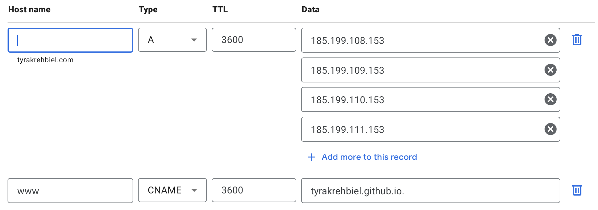
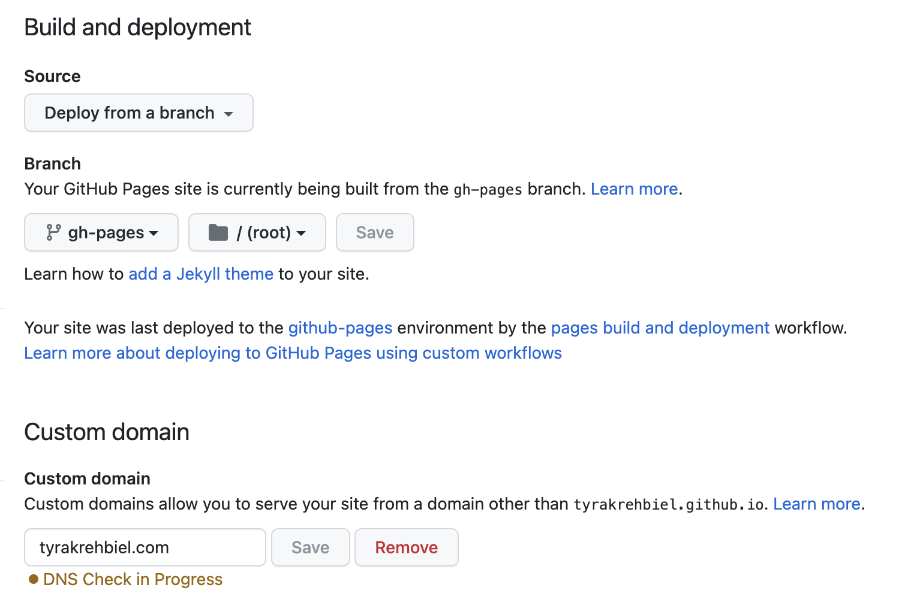

# How I Made This

Documenting the process for developing this personal portfolio application

## Creating the app

```shell
npx create-react-app portfolio-website --template typescript # create React typescript application
```

## Dependency Setup

1. [Material UI](https://mui.com/material-ui/getting-started/installation/)
1. [Sass](https://sass-lang.com/install/)
1. [React Router Dom](https://reactrouter.com/en/main/start/tutorial)
1. [Redux Toolkit](https://redux-toolkit.js.org/introduction/getting-started)
1. Github pages

```shell
yarn add @mui/material @emotion/react @emotion/styled
yarn add sass
yarn add react-router-dom
yarn add @reduxjs/toolkit
yarn add gh-pages
```

### Linter

```shell
yarn eslint --init # begin installation
```

The following settings were used in installation

```shell
You can also run this command directly using 'npm init @eslint/config'.
✔ How would you like to use ESLint? · style
✔ What type of modules does your project use? · esm
✔ Which framework does your project use? · react
✔ Does your project use TypeScript? · No / Yes
✔ Where does your code run? · browser
✔ How would you like to define a style for your project? · prompt
✔ What format do you want your config file to be in? · JSON
✔ What style of indentation do you use? · 4
✔ What quotes do you use for strings? · single
✔ What line endings do you use? · unix
✔ Do you require semicolons? · Yes
Local ESLint installation not found.
The config that you've selected requires the following dependencies:

@typescript-eslint/eslint-plugin@latest eslint-plugin-react@latest @typescript-eslint/parser@latest eslint@latest
? Would you like to install them now? · Yes
```

## CI/CD

### Configure custom domain

Prerequisite: Have a custom domain through Google domains.

1. Go to [Google domains](https://domains.google/) and manage your domain
1. In the sidebar, click **DNS** to open DNS settings
1. Click **Manage custom records** and add the following records



> Refer to this [documentation](https://docs.github.com/en/pages/configuring-a-custom-domain-for-your-github-pages-site/managing-a-custom-domain-for-your-github-pages-site#configuring-a-records-with-your-dns-provider) from Github

### Setup Github Pages

Prerequisite: Remote repository is set up

1. Go to the repository settings
1. In **General Settings**, change repository to Public
1. In **Pages**, set up github pages deployment through a branch



### Code coverage with Codecov

1. Go to [Codecov site](https://app.codecov.io/gh/tyrakrehbiel)
1. Click **Setup repo** and follow instructions

### Github Actions workflow

Create the github actions workflow file to automatically test, check lint errors, build, and deploy app
